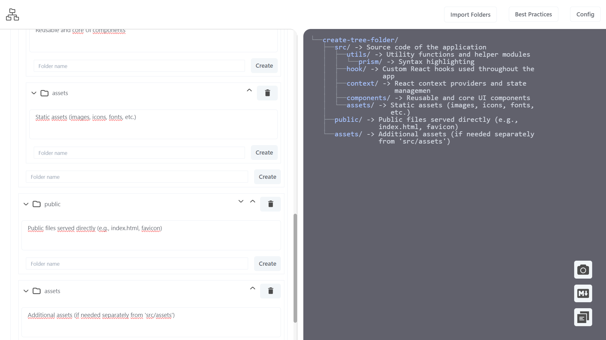
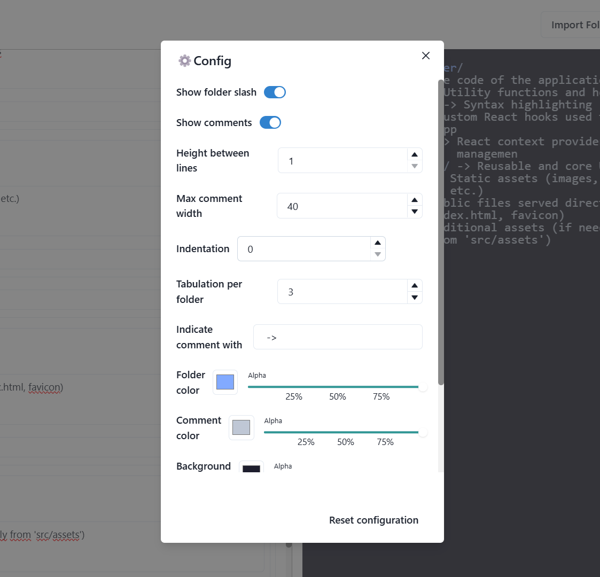
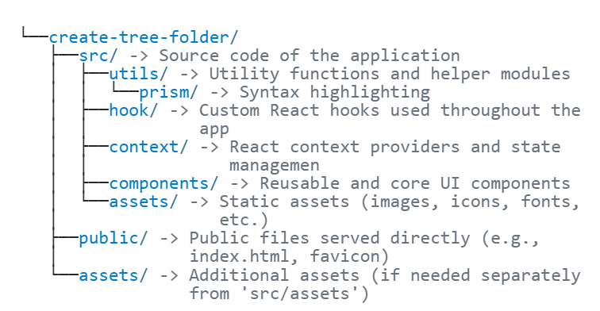

# 🌳 Tree Creator

A simple and efficient tool to generate your project's folder structure in ASCII format.



## ✨ Features

-  🧠 Web-based, no installation required
-  📂 Import, create, and delete folders with ease
-  🧾 Real-time visualization of your project's folder tree
-  🔧 High customization options (font color, background color, indentation, and more)
   
-  🎨 Light/Dark theme support with customizable templates (see Best Practices)
   <picture>
      <!-- Big image for wide screens in dark mode -->
      <source srcset="./assets/tree-folder-dark.png" media="(prefers-color-scheme: dark)" />

  <source srcset="./assets/tree-folder-light.png" media="(prefers-color-scheme: light)" />

  
</picture>

## 🧑‍💻 Contributing

To contribute to the development of **Tree Creator**, follow these steps:

1. Fork this repository
2. Clone the project and run it locally

```bash
git clone https://github.com/your-username/tree-creator.git
cd tree-creator
npm install
npm run dev
```

3. After end do pull request
